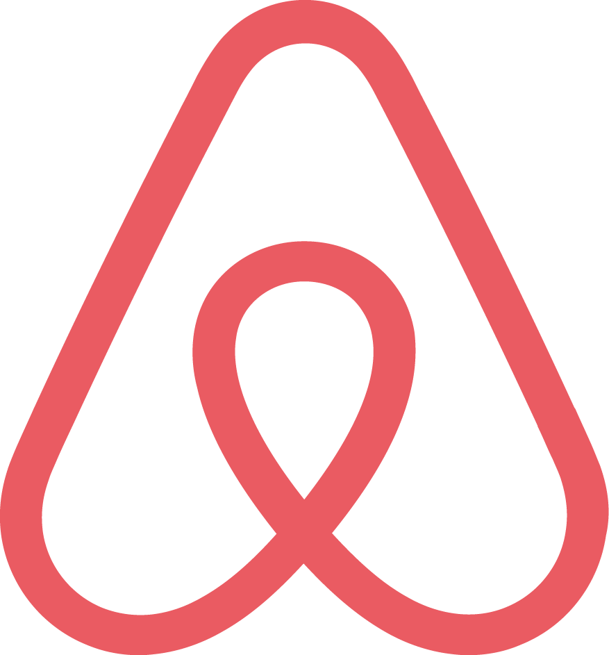
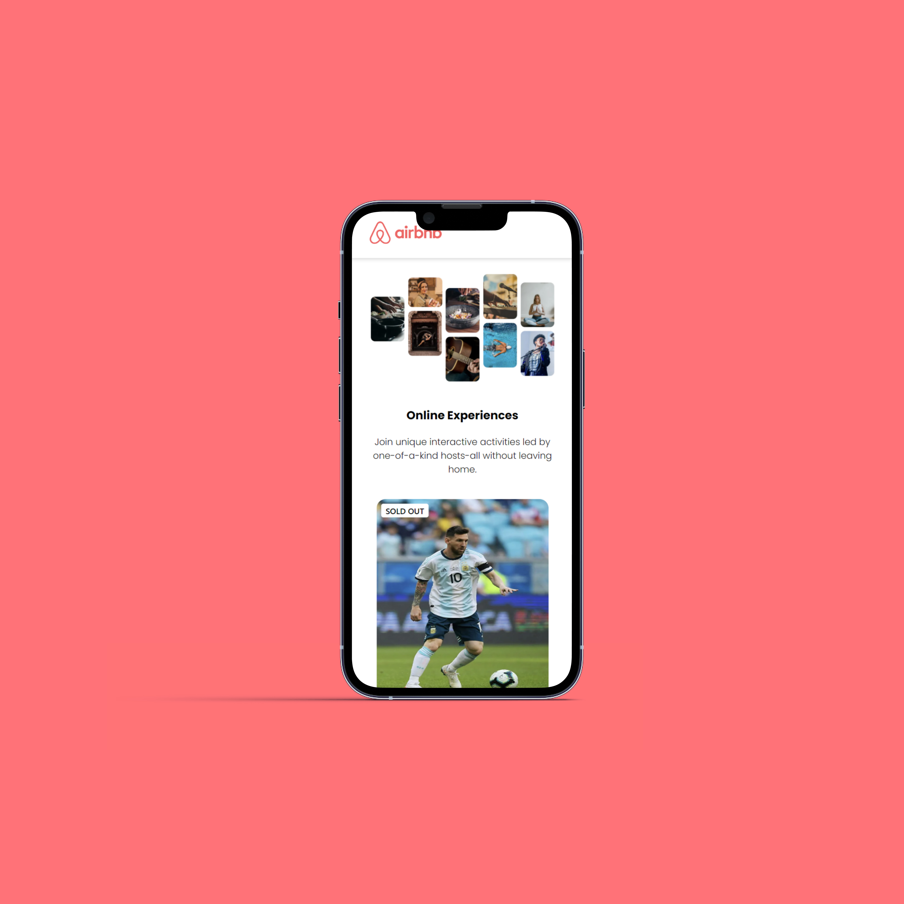
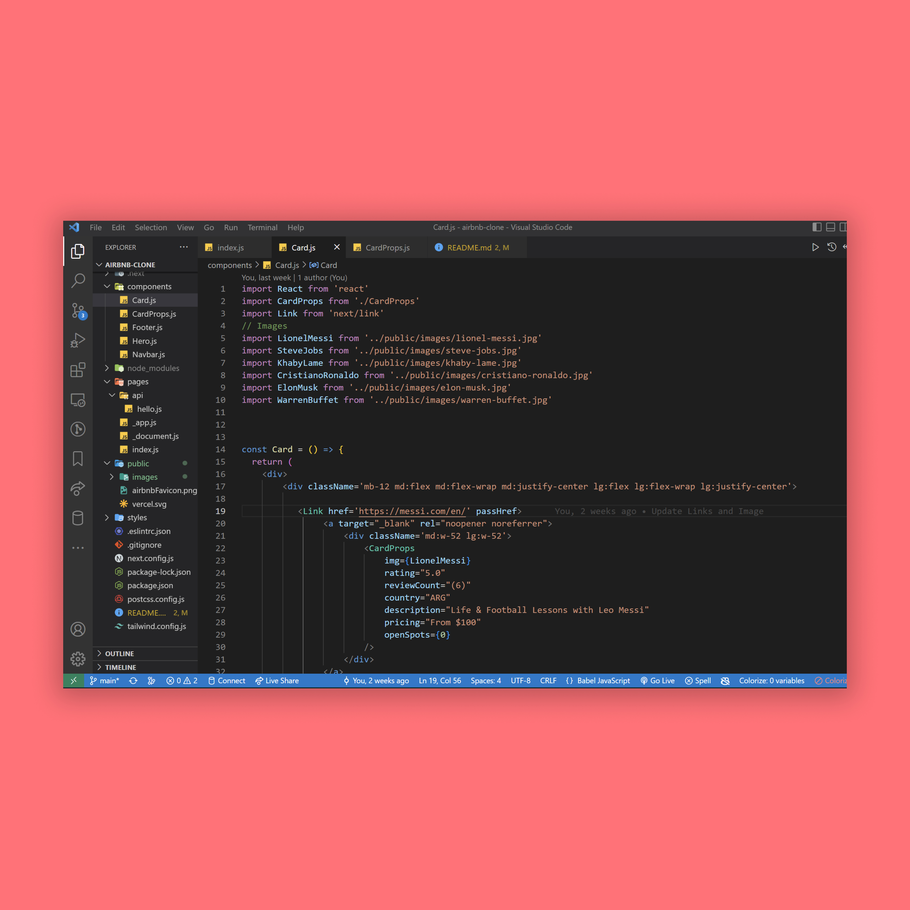

<!-- markdownlint-configure-file {
  "MD013": {
    "code_blocks": false,
    "tables": false
  },
  "MD033": false,
  "MD041": false
} -->

  

# AirBnb Clone

This is the AirBnb Clone Project from Scrimba Project Lesson

It is made with Next JS utilizing the React Props Component.

## Website

🖥️ [https://airbnb-clone-by-johncanero.vercel.app/]

✍️ Project by John Cañero

## Responsive Design

🪟: [Desktop - Tablet - Mobile]

